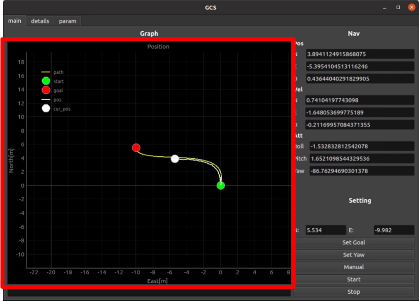
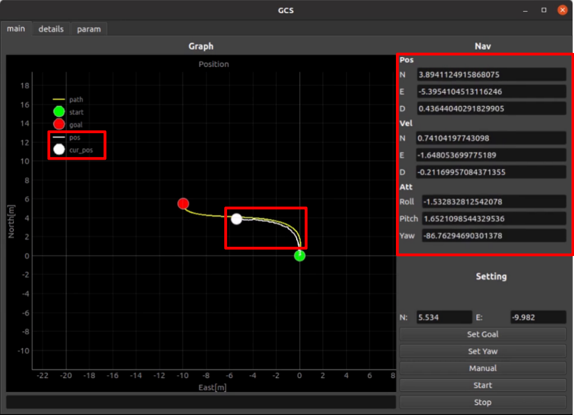
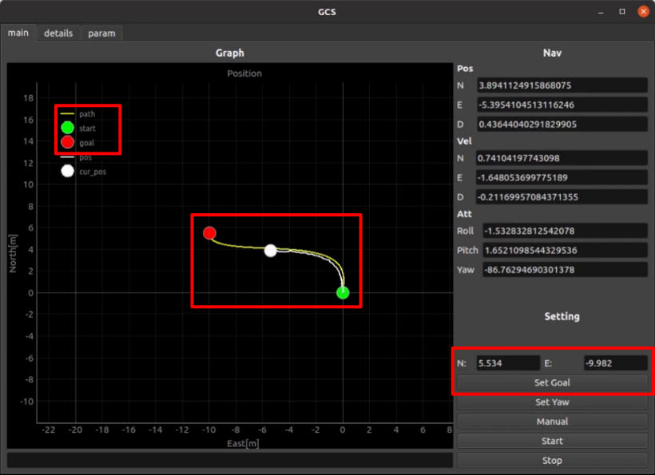
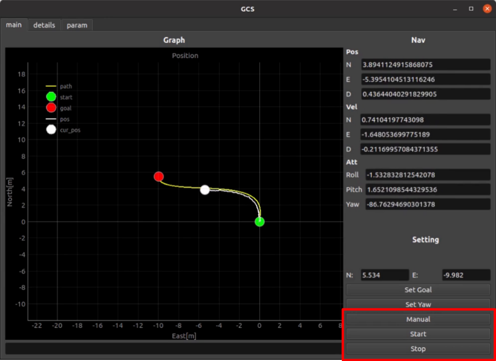
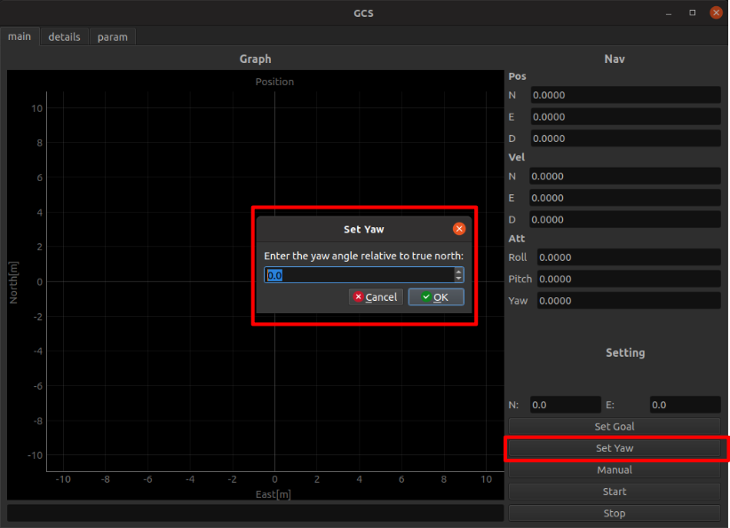

# Ground Control System

## Feature
### 1. Vehicle Position
Plot the real-time position of the vehicle.
- Subscribe topic : /nav_topic
<p align="center">  </p>

### 2. Status Monitoring
Monitoring the real-time status(position, velocity, attitude) of the vehicle.
- Subscribe topic : /nav_topic
<p align="center">  </p>

### 3. Set Goal
Send the goal point to the vehicle. Mouse-click a point on the graph and set it as your destination. Or, Even if you enter the target coordinates and press the `Set Goal`, it is set as the destination.
- Publish topic : /start_goal_topic
<p align="center">  </p>

### 4. Set Command
Send the command to the vehicle.
- Publish topic : /command_topic
  - `Manual` (data = 2, When you want to change to keyboard control)
  - `Start` (data = 1, Motor On)
  - `Stop` (data = 0, Motor Off)

<p align="center">  </p>

### 5. Set Yaw
When the vehicle's heading is unknown, It is possible to set an initial yaw. A pop-up window will appear if you click Set Yaw. And then, enter the angle value [degree] and press the OK.
- Publish topic : /setyaw_topic
<p align="center">  </p>

## Build
### Remote PC
```bash
cd ~/ros2_ws/src/autoRCcar_outdoor/autorccar_gcs
pip3 install -r requirement.txt

cd ~/ros2_ws
colcon build --symlink-install --packages-select autorccar_gcs
source install/setup.bash
```
## Run
```bash
ros2 run autorccar_gcs autorccar_gcs
```
